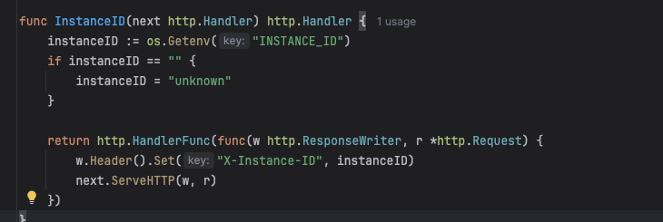
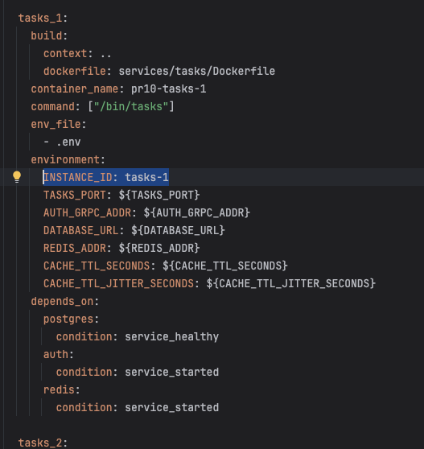
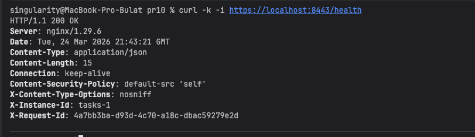

# Практическое занятие №10
# Саттаров Булат Рамилевич ЭФМО-01-25
# Горизонтальное масштабирование: использование Load Balancer (NGINX)


---

## 1. Количество реплик и конфигурация

В системе запущены две реплики сервиса `tasks`: 
- `tasks_1` с `INSTANCE_ID=tasks-1` 
- `tasks_2` с `INSTANCE_ID=tasks-2`

Обе реплики работают на внутреннем порту `8082` внутри docker-сети.

Сервисы являются stateless и используют общие ресурсы: 
- PostgreSQL 
- Redis

Middleware для Instance ID:


Пример контейнера tasks-1 в docker-compose:


---

## 2. Конфигурация NGINX

NGINX используется как балансировщик нагрузки и распределяет запросы
между репликами.

``` nginx
events {}

http {
  upstream tasks_upstream {
    server tasks_1:8082;
    server tasks_2:8082;
  }

  server {
    listen 8443 ssl;
    server_name localhost;

    ssl_certificate     /etc/nginx/tls/cert.pem;
    ssl_certificate_key /etc/nginx/tls/key.pem;

    location /v1/auth/ {
      proxy_pass http://auth:8081;
      proxy_set_header Host $host;
      proxy_set_header X-Forwarded-Proto https;
      proxy_set_header X-Request-ID $http_x_request_id;
      proxy_set_header Authorization $http_authorization;
      proxy_set_header Content-Type $content_type;
      proxy_set_header Cookie $http_cookie;
      proxy_set_header X-Forwarded-For $proxy_add_x_forwarded_for;
    }

    location /health {
      proxy_pass http://tasks_upstream;
      proxy_set_header Host $host;
      proxy_set_header X-Forwarded-Proto https;
      proxy_set_header X-Request-ID $http_x_request_id;
      proxy_set_header Authorization $http_authorization;
      proxy_set_header Content-Type $content_type;
      proxy_set_header Cookie $http_cookie;
      proxy_set_header X-Forwarded-For $proxy_add_x_forwarded_for;
    }

    location / {
      proxy_pass http://tasks_upstream;
      proxy_set_header Host $host;
      proxy_set_header X-Forwarded-Proto https;
      proxy_set_header X-Request-ID $http_x_request_id;
      proxy_set_header Authorization $http_authorization;
      proxy_set_header Content-Type $content_type;
      proxy_set_header Cookie $http_cookie;
      proxy_set_header X-Forwarded-For $proxy_add_x_forwarded_for;
    }
  }
}
```


Upstream блок определяет группу backend-серверов, между которыми NGINX будет распределять входящие запросы.

Здесь указаны две реплики сервиса:
-	tasks_1:8082
-	tasks_2:8082

Так как в конфигурации не указан специальный алгоритм, NGINX использует round-robin по умолчанию.
Это значит, что запросы будут поочерёдно отправляться на tasks_1 и tasks_2.

---

## 3. Health endpoint

В сервисе реализован endpoint `/health`, который возвращает состояние
сервиса.

``` bash
curl -k -i https://localhost:8443/health
```


---

## 4. Демонстрация балансировки

Запуск:
```bash
cd ./deploy
cp  .env.example .env
docker compose up -d --build
```
Запущено:


Логин:
```bash
curl -k -i -X POST https://localhost:8443/v1/auth/login \
  -H "Content-Type: application/json" \
  -c cookies.txt \
  -d '{"username":"student","password":"student"}'
```


Серия запросов:

``` bash
for i in {1..10}; do
  curl -k -s -i https://localhost:8443/v1/tasks \
    -b cookies.txt | grep -i "X-Instance-ID"
done
```


---

## 5. Отказоустойчивость

Остановка одной реплики:

``` bash
docker compose stop tasks_1
```


Проверка:

``` bash
for i in {1..5}; do
  curl -k -s -i https://localhost:8443/v1/tasks \
    -b cookies.txt | grep -i "X-Instance-ID"
done
```


Система продолжает работать за счёт второй реплики.

---

